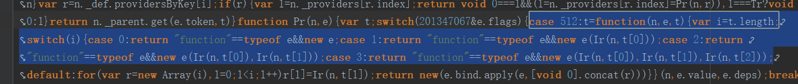

[](https://travis-ci.org/cipchk/ng-alain)
[](https://david-dm.org/cipchk/ng-alain)
[](https://www.npmjs.com/package/ng-alain)

# ng-alain

一套基于 [Ng-zorro-antd](https://github.com/NG-ZORRO/ng-zorro-antd)【ANT DESIGN】 的企业后台模板。

[README in English](README.md)

[DEMO](https://cipchk.github.io/ng-alain/)

## 快速入门

有二种方式进行安装：

### 命令行工具

需要依赖于 `@delon/cli`，[如何安装？](http://ng-alain.com/docs/cli)

```bash
ng new -c=@delon/cli my-app
```

### 直接 clone git 仓库

```bash
$ git clone --depth=1 https://github.com/cipchk/ng-alain.git my-project

cd my-project

# 安装依赖包
npm install

# 启动
npm start

# 使用HMR启动
npm run serve:hmr
```

> [vscode] 建议安装 [ng-zorro-vscode](https://marketplace.visualstudio.com/items?itemName=cipchk.ng-zorro-vscode) 插件，含 `nz-alain-*` 代码片断。


## Links

+ [文档](http://ng-alain.com)
+ [@delon](https://github.com/cipchk/delon)
+ [DEMO](https://cipchk.github.io/ng-alain/)

## 旅链

文件路径：

所有业务逻辑相关文件
src/app/routes/lvl

登录注册相关文件
src/app/passport

图片路径 
src/assets/img

开发环境启动项目：
```bash
$ ng serve
```
开发完打包生成项目：
```bash
$ ng build --prod
```
注意：每次修改项目都需要重新打包生成项目!!!

执行 ng build --prod 之后，项目根目录会生成一个dist目录，
需要搜索替换dist目录里面的main.xxx.js文件中的几处代码，
搜索case 512:t=function(n,e,t){var i=t.length，
在后面switch 方法体里面 case 0,1,2,3之后return new e的new e之前添加
"function"==typeof e&&

修改之后代码截图：




修改完成之后，把dist目录里面的所有文件拷贝上传到服务器docker-v/nginx9000/html
目录，然后强制刷新界面就可以了。

## 特性

+ 基于 `ng-zorro-antd`
+ 响应式
+ 国际化
+ ACL访问控制
+ 延迟加载及良好的启用画面
+ 良好的UI路由设计
+ 十种颜色版本
+ Less预编译
+ 良好的目录组织结构
+ 简单升级
+ 模块热替换
+ 支持Docker部署
+ 支持[Electron](http://ng-alain.com/docs/cli#electron)打包（限cli构建）

## 应用截图


## Troubleshooting

Please follow this guidelines when reporting bugs and feature requests:

1. Use [GitHub Issues](https://github.com/cipchk/ng-alain/issues) board to report bugs and feature requests (not our email address)
2. Please **always** write steps to reproduce the error. That way we can focus on fixing the bug, not scratching our heads trying to reproduce it.

Thanks for understanding!

### License

The MIT License (see the [LICENSE](https://github.com/cipchk/ng-alain/blob/master/LICENSE) file for the full text)
